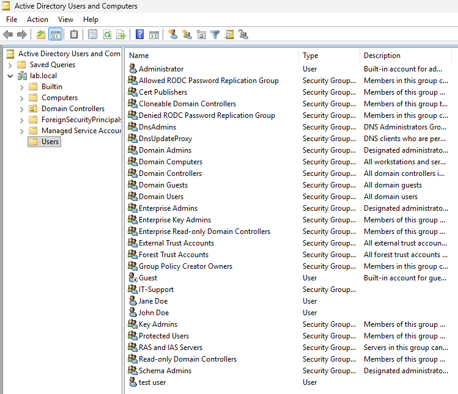
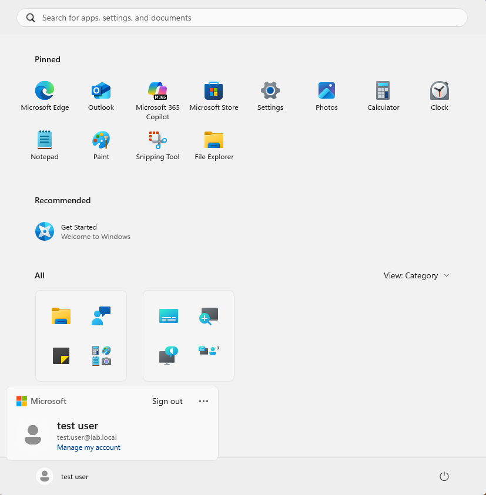
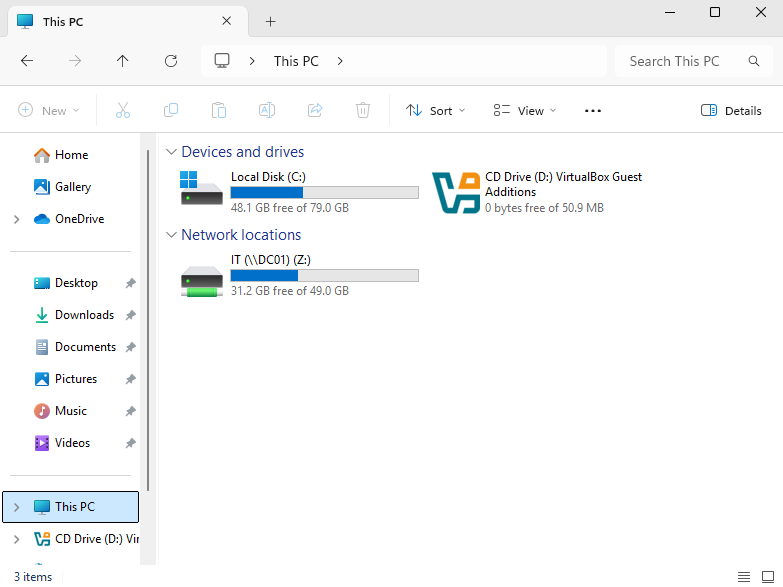
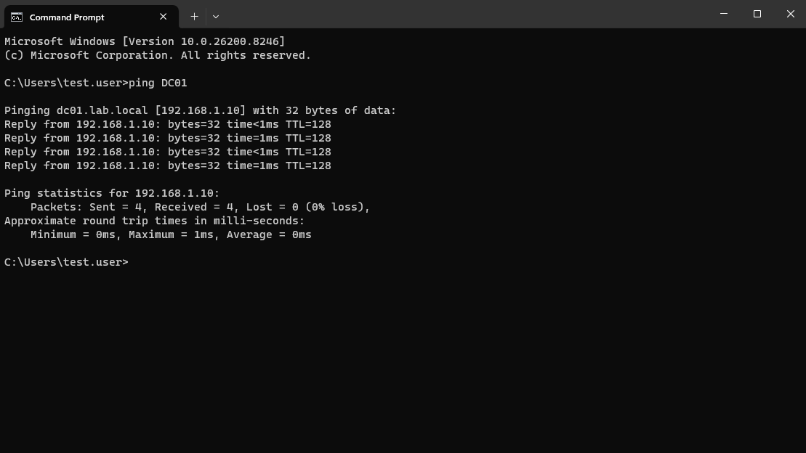

# Active Directory Home Lab

## What I did
Set up a Domain Controller and connected a client machine.

## Tools
- Windows Server
- VirtualBox

## Steps
1. Installed Windows Server
2. Promoted to Domain Controller (DC01)
3. Created users in Active Directory
4. Joined a client machine to the domain
5. Mapped a network drive

## What I learned
- How Active Directory works
- User authentication basics
- Basic troubleshooting

## Screenshots

